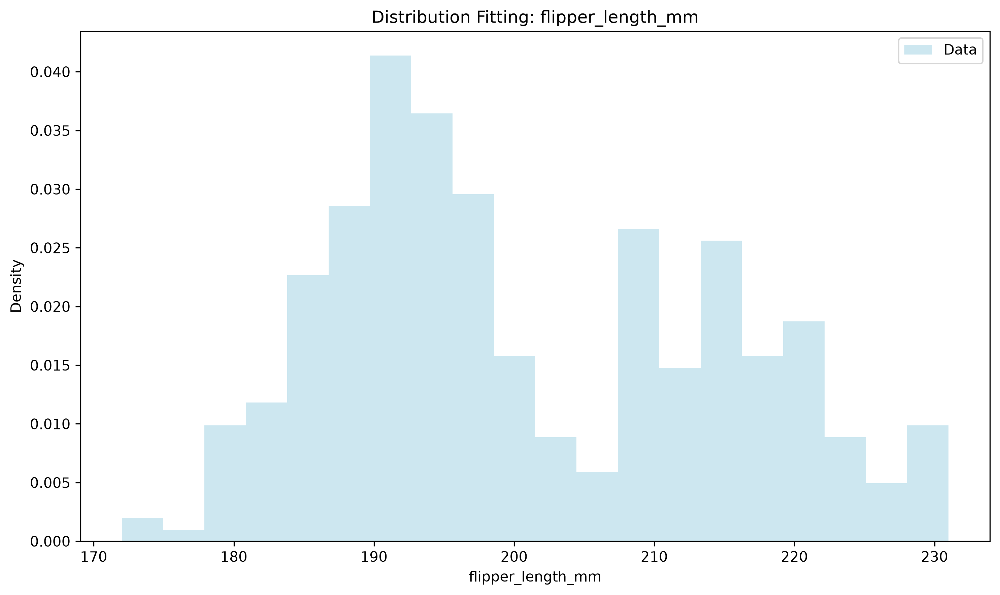
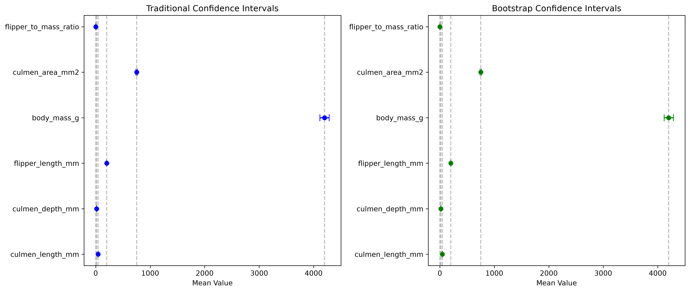

# Week 2 Report: Statistical Analysis

## Team: Statistical Superstar
**Date:** 13/9/2026

---

## 1. Hypothesis Testing Results

### 1.1 T-Tests

| Test | Variable 1 | Variable 2 | t-statistic | p-value | Significant |
|------|-----------|-----------|-------------|---------|--------------|
| One-sample | flipper_length_mm | 200 | 1.180 | 0.2387 | No |
| Independent | body_mass_g (Adelie) | body_mass_g (Chinstrap) | -0.473 | 0.6367 | No |

**Interpretation:**
- The mean flipper length is not significantly different from 200 mm (p = 0.24 > 0.05). The observed mean (200.9 mm) is close enough to 200 mm that we cannot conclude a real difference exists.
- Mean body mass does not differ significantly between the Adelie and Chinstrap species (p = 0.64). These two species have similar body mass in this sample.

### 1.2 ANOVA

| Variable | Groups | F-statistic | p-value | Significant |
|----------|--------|-------------|---------|--------------|
| body_mass_g | species (3 groups) | 337.587 | < 0.0001 | Yes |

**Interpretation:**
- When comparing mean body mass across all three species (Adelie, Chinstrap, Gentoo) simultaneously, the difference is highly significant (p < 0.0001), meaning at least one species has a mean body mass that differs from the others.
- Interestingly, the pairwise t-test in 1.1 found no significant difference between Adelie and Chinstrap, yet the ANOVA is highly significant. This is likely driven by the third species, Gentoo, which is noticeably larger than the other two, pulling the overall group comparison toward significance.

### 1.3 Chi-Square Test

| Variable 1 | Variable 2 | χ²-statistic | p-value | Significant |
|-----------|-----------|--------------|---------|--------------|
| species | island | 299.550 | < 0.0001 | Yes |

**Interpretation:**
- Species and island are significantly associated (p < 0.0001). This means penguin species are not randomly distributed across islands; each species tends to be concentrated on specific islands.

---

## 2. Distribution Fitting

### 2.1 Best-Fitting Distributions

| Column | Best Fit | p-value | Good Fit? |
|--------|----------|---------|-----------|
| culmen_length_mm | Gamma | 0.0715 | Yes |
| culmen_depth_mm | Gamma | 0.0189 | No |
| flipper_length_mm | Gamma | 0.0033 | No |
| body_mass_g | Gamma | 0.2542 | Yes |
| culmen_area_mm2 | Gamma | 0.8060 | Yes |
| flipper_to_mass_ratio | Gamma | 0.4593 | Yes |

### 2.2 Distribution Visualizations

**Interpretation:**
- Across all six numeric variables, a Gamma distribution provided the best fit compared to Normal, Exponential, Lognormal, and Uniform. None of the variables were best described by a Normal distribution, though several (culmen_length_mm, body_mass_g, culmen_area_mm2, flipper_to_mass_ratio) still fit the Gamma distribution reasonably well (p > 0.05).
- culmen_depth_mm and flipper_length_mm had the weakest fits overall (p = 0.019 and p = 0.003), meaning even the best-matching distribution does not describe their shape particularly well. Their true underlying distribution may be more complex, likely because the data pool multiple species with different size ranges together.
- Since no variable is well-described by a Normal distribution, this supports using non-parametric alternatives (e.g., Mann-Whitney U instead of an independent t-test, or Kruskal-Wallis instead of ANOVA) as a robustness check alongside the parametric tests used in Section 1.

---

## 3. Confidence Intervals

### 3.1 Traditional Confidence Intervals (95%)

| Column | Mean | CI Lower | CI Upper | Width |
|--------|------|----------|----------|-------|
| culmen_length_mm | 43.925 | 43.350 | 44.500 | 1.151 |
| culmen_depth_mm | 17.152 | 16.944 | 17.360 | 0.416 |
| flipper_length_mm | 200.892 | 199.410 | 202.374 | 2.964 |
| body_mass_g | 4200.872 | 4116.365 | 4285.379 | 169.015 |
| culmen_area_mm2 | 750.891 | 738.729 | 763.054 | 24.325 |
| flipper_to_mass_ratio | 0.0490 | 0.0483 | 0.0497 | 0.00138 |

### 3.2 Bootstrap Confidence Intervals (95%)

| Column | Mean | CI Lower | CI Upper | Width |
|--------|------|----------|----------|-------|
| culmen_length_mm | 43.925 | 43.353 | 44.494 | 1.140 |
| culmen_depth_mm | 17.152 | 16.946 | 17.363 | 0.417 |
| flipper_length_mm | 200.892 | 199.427 | 202.369 | 2.942 |
| body_mass_g | 4200.872 | 4117.580 | 4287.064 | 169.484 |
| culmen_area_mm2 | 750.891 | 738.875 | 763.093 | 24.218 |
| flipper_to_mass_ratio | 0.0490 | 0.0483 | 0.0497 | 0.00139 |

**Comparison:**
- The traditional and bootstrap confidence intervals are nearly identical for every variable, with interval widths differing by less than 1% in all cases (e.g., flipper_length_mm: 2.964 traditional vs. 2.942 bootstrap).
- This agreement is expected given the sample size (n = 150, well above the n ≥ 30 threshold for the Central Limit Theorem to apply). With a large enough sample, the sampling distribution of the mean approaches normality regardless of the underlying data distribution, so the traditional z-based CI and the distribution-free bootstrap CI converge on essentially the same range. This holds even though Section 2 showed most variables are not individually well-described by a Normal distribution.

---

## 4. Key Statistical Findings

1. **Normality**: None of the 6 numeric variables were best fit by a Normal distribution; a Gamma distribution fit best in every case, and only 4 of the 6 variables (culmen_length_mm, body_mass_g, culmen_area_mm2, flipper_to_mass_ratio) were considered a "good fit" even under Gamma (p > 0.05) (see Table 2.1)
2. **Significant Differences**: A significant difference in body mass was found across penguin species (ANOVA, p < 0.0001), and a significant association was found between species and island (Chi-square, p < 0.0001)
3. **Distribution**: The best-fitting distribution across all variables is Gamma, though fit quality varies, strongest for culmen_area_mm2 (p = 0.806) and weakest for flipper_length_mm (p = 0.003)
4. **Confidence**: We are 95% confident that the true mean of each variable falls within the ranges shown in Tables 3.1/3.2, and the traditional and bootstrap methods agree closely for all variables

---

## 5. Interpretation & Conclusions

### 5.1 What the Results Mean
- Penguin body mass varies clearly by species, with Gentoo notably larger than the other species, while Adelie and Chinstrap are similar in size.
- Penguin species tend to inhabit specific islands rather than being randomly distributed across all islands.
- None of the measured variables follow a Normal distribution particularly well; a Gamma distribution was consistently the best fit, though for flipper_length_mm and culmen_depth_mm even that fit was weak, suggesting these traits may combine sub-populations (e.g., different species or sexes) with distinct size ranges.
- Despite this lack of normality, the 95% confidence intervals from the traditional and bootstrap methods agreed closely for all variables, showing that with a large enough sample (n = 150) the mean estimate is stable regardless of the shape of the underlying distribution.

### 5.2 Limitations
- Sample size was n = 150 across the numeric variables analyzed, which is large enough for the Central Limit Theorem to justify the traditional confidence interval approach, but still a single dataset from a specific time period and set of islands.
- T-tests and ANOVA assume each group is approximately normally distributed with similar variances; these assumptions should be checked further before drawing strong conclusions, especially since Section 2 showed none of the variables are well-described by a Normal distribution on their own.
- Potential confounding variables were not accounted for in this analysis, such as sex or the season data was collected.

### 5.3 Recommendations for Week 3
- Create visualizations comparing variable distributions across species more clearly (e.g., a boxplot of body_mass_g by species).
- Re-run the key hypothesis tests using non-parametric alternatives (Mann-Whitney U, Kruskal-Wallis) to confirm the parametric results hold given the non-Normal distributions found in Section 2.
- Consider building an interactive dashboard that lets users explore relationships between variables.

---

## 6. Team Contributions

| Team Member | Tasks Completed | Hours |
|-------------|------------------|-------|
| Student A | Data prep, environment management | [hours] |
| Student B | All statistical tests & analysis | [hours] |
| Student C | Visualization support | [hours] |

---

## Appendix

**Files Generated:**
- `../reports/hypothesis_tests_summary.csv`
- `../reports/distribution_fitting_summary.csv`
- `../reports/ci_comparison.csv`
- `../reports/figures/distribution_fit_*.png`
- `../reports/figures/confidence_intervals_comparison.png`

**Notebooks:**
- `notebooks/02_hypothesis_testing.ipynb`
- `notebooks/03_distribution_fitting.ipynb`
- `notebooks/04_confidence_intervals.ipynb`